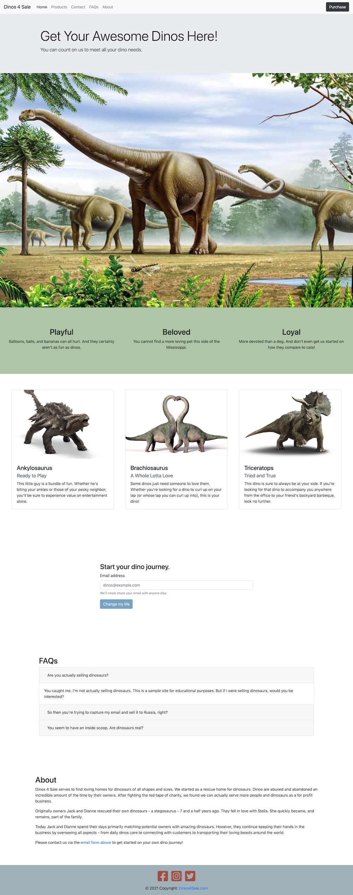

# Dinos for Sale

[Dinos 4 Sale - Live Site](https://dinos-4-sale-83d45b.netlify.app/)

Personal html, css, and bootstrap project for [Nucamp](https://www.nucamp.co/).

This site uses a combination of html and css including use of bootstrap and flexbox. My overall intention was to create a basic one-page sales site.

## Dev Dependencies

```
npm install lite-server@2.5.4 --save-dev
npm install jquery@3.5.1 popper.js@1.16.1
npm install bootstrap@4.5.2
npm install --save-dev node-sass@4.14.1
npm install --save-dev onchange@7.0.0
npm install --save-dev -E parallelshell@3.0.1
```

### Project Commands
#### Start Local Server
From project directory:
`npm start`

#### Create Build
Will create fresh build files (minify, uglify, etc) and put them in the dist folder to host elsewhere.
From project directory:
`npm run build`

## Project Background/Report

### Introduction

This site was built while learning html, css, Bootstrap, and flexbox. The intention of the site is to serve as a basic sales landing page with a specific call to action - submit your email address. The dinosaur content is arbitrary and just serves as interesting content.

### Design & Implementation

During the course, Bootstrap and css were focused on. I also learned some flexbox independently as I found myself fighting against Bootstrap at times and wanted to implement some things in a different manner (especially in regards to how the site responded at different screen widths).

My original [wireframe is here](https://www.figma.com/file/VEuehsoE4nMfueOlpC0V8s/Dinos-for-Sale-Wireframe?node-id=281170%3A448). As I worked on the site, I made adjustments in some implementation details (like adjusting section-content and the color scheme). I found having a wireframe was helpful as it gave me a specific structure, but allowed me the freedom to make implementation adjustments as I saw fit.

Most individual components are from Bootstrap including:

- Navbar
- Jumbotron
- Image carousel
- Cards for products (however I used flexbox to put the cards in)
- Email-capture form
- FAQ collapsing groups

Flexbox is used:

- To contain product cards

I also used:

- SCSS
- Media breakpoints to ensure responsivity at widths of >992px, 992px-577px, and <576px

As I spent more and more time in the code, I found myself doing a bit of tinkering on button transitions, responsivity, and color choices. One specific example is the product-cards. The h4 text was wrapping strangely at certain viewport widths so I adjusted the responsivity (by stacking the cards sooner than I had been) to accommodate a better user experience.

Another small thing that I did was keep the ‘Dinos Here!’ text together when the h1 wraps in the jumbotron on smaller viewports - it’s a minor thing, but I appreciate small attention to those type of details.


I also thought through changing the hover of the ‘Change my life’ button - at larger screens the button fades from blue to white on hover. However, on mobile devices (likely using touch instead of a mouse), that functionality doesn’t make sense so the color remains static.


Another detail I tackled was when selecting a navbar item, the section would overlap just a little under the navbar. I adjusted the overlap by adding blank content to display before my major sections thus pushing that content below the navbar.


### Conclusions

From the project I learned basics of putting a static site together using html and css. I learned that although a tool like Bootstrap is convenient (especially with things like navbars), the tradeoff is a loss of control and customization. In future projects, I will likely reach for flexbox first and use Bootstrap only if needed as a direct benefit.

The best feature of my site is its responsivity. I get enjoyment out of resizing the viewport and seeing everything adjust to how I like.

If the site has any shortcomings, it’s the simplicity. I was tempted to make something a bit more complicated than a single page static site. However, my purpose in the project was to primarily focus on html and css which seemed best served through simplicity (besides the fact that for the purpose of the fake business I wanted a very simple, clean site).

Were I doing the project from the beginning knowing what I know now, I’d probably do things to challenge myself more like use less Bootstrap and possibly implement some further complex code like using a modal for the purchase button (rather than just linking to the email form) or using some javascript to mimic successfully capturing an email submission. I’m also still not fully convinced I like the rust color of the social media buttons.


